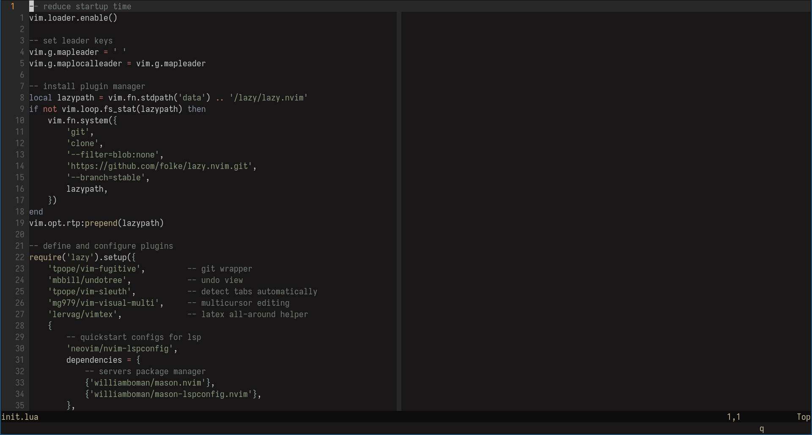
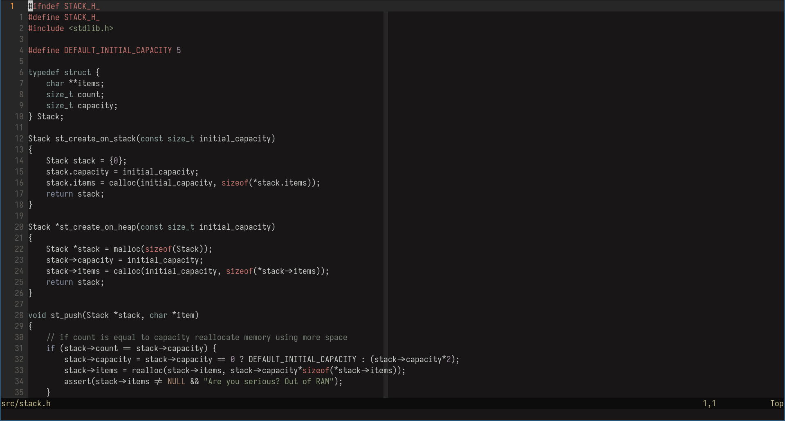
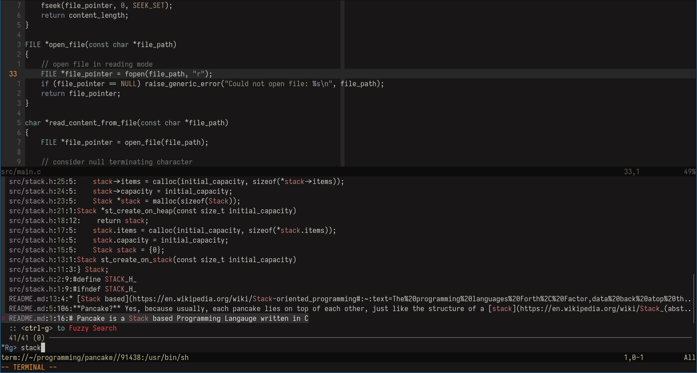
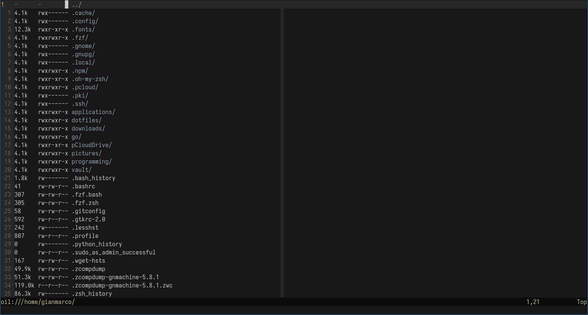

Always a WIP :)
# Modern but minimal and bloatfree neovim configuration
I've configured just what I really need, what I really use, this configuration follows principles in line with those of minimalism

## Features
* Simple: lives just in a single file, fuck off lua's module
* On-target: it includes just what I really need, keep out unnecessary plugins or customizations
* Well documented: you can find comments here and there

